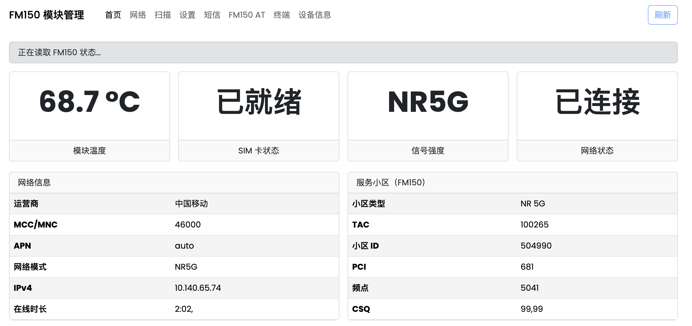

# FM150 WebUI

面向 **Fibocom FM150-AE/NA-01** 的独立 Web 管理界面，运行在模组内部。

## 页面预览



## 功能

- 首页：SIM、温度、网络模式、APN、IPv4、服务小区和运营商信息。
- 网络：FM150 的 `GTACT`、`GTDUALSIM`、`GTRNDIS`、`GTUSBMODE?` 管理。
- 扫描：`AT+GTCCINFO?` 服务/邻区信息。
- 设置：FM150 网络制式、SIM、ECM 与 USB 模式。
- 短信：保留标准 3GPP SMS AT 工作流，并修正 UCS2 发件人显示。
- 设备信息：按项目单独读取 ATI、IMEI、IMSI、ICCID、号码与 PDP 地址，避免并发占用 AT 串口。
- FM150 AT：预设 FM150 指令与原始回显。

## 一键部署

在 FM150 模组的 root shell 中运行：

```sh
cd /tmp && \
wget -O fm150-webui-install.sh https://raw.githubusercontent.com/AIxBits/fm150-webui/main/install.sh && \
chmod +x fm150-webui-install.sh && \
./fm150-webui-install.sh
```

安装程序会：

1. 将网站安装到 `/usrdata/fm150-webui/www`。
2. 安装并启动运行所需服务组件。
3. 安装一个 BusyBox `httpd` 服务；默认端口为 **8080**。

默认访问地址为：`http://<模组 bridge0 IP>:8080/`。例如模组地址为 `192.168.225.1` 时，使用 `http://192.168.225.1:8080/`。

> Web 页面允许发送经过页面功能限定的 AT 指令。请仅在受信任的本地网络中使用；如需公网访问，请自行在上层网络配置认证和访问控制。

## 已验证的 FM150 指令

| 用途 | 指令 |
| --- | --- |
| 网络模式 | `AT+GTACT=2`、`AT+GTACT=14`、`AT+GTACT=20` |
| 服务小区 | `AT+GTCCINFO?` |
| 网络制式 | `AT+PSRAT?` |
| SIM | `AT+CPIN?`、`AT+GTDUALSIM=0/1` |
| PDP / 地址 | `AT+CGDCONT?`、`AT+CGPADDR` |
| USB / ECM | `AT+GTUSBMODE?`、`AT+GTRNDIS=1,1`、`AT+GTRNDIS=0,1` |
| 温度 | `AT+MTSM=1,6` |
| 设备识别 | `ATI`、`AT+CGSN`、`AT+GTSN=0,7` |

## 项目归属与参考

维护：**AIxBits**。

实现参考：[cachenow/quectel-webui](https://github.com/cachenow/quectel-webui) 的页面组织方式，以及 [iamromulan/quectel-rgmii-toolkit](https://github.com/iamromulan/quectel-rgmii-toolkit) 的桥接思路；本仓库只保留 FM150 所需实现。

Copyright © 2024–2026 AIxBits. All rights reserved.
## 支持项目

如果本项目对您的 FM150 使用有帮助，欢迎点击仓库右上角的 **Star** 支持项目，也欢迎反馈 FM150-AE/NA-01 的兼容性与使用体验。
